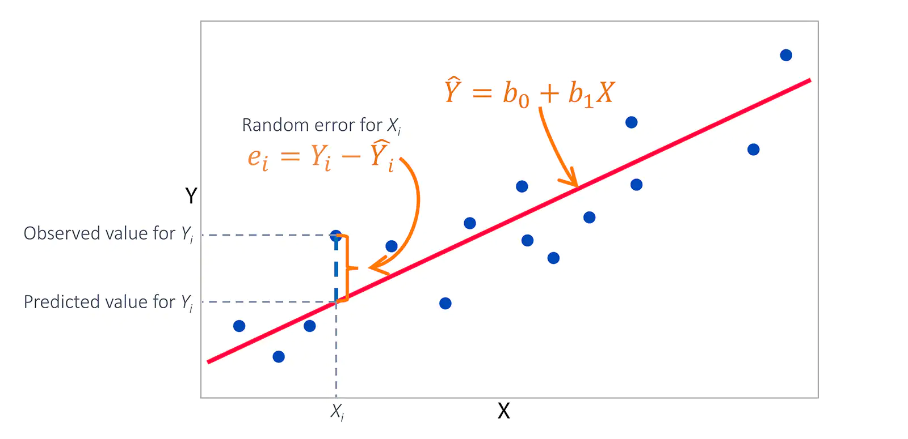

## Before we begin

 https://www.edwardtufte.com/tufte/powerpoint 
 (or https://www.inf.ed.ac.uk/teaching/courses/pi/2016_2017/phil/tufte-powerpoint.pdf)
 
 Try: https://www.google.com/search?q=tufte+columbia (or **Death by PowerPoint**)

## The linear regression model

The LRM can be written as:

Yi = b0 + b1i X1 + ... + b_ki Xk + ui

where:

* Y is is dependent (exploratory),

* X1,..., Xk independent variables (explanatory/regressors/predictors)

* ui is random **term**

The subscript i denotes i-th observation. The above can
be written in matrix notation:

Y = BX + u

## Model building

* specification, ie selection of variables etc (economic theory)

* estimation (by computer :-)

* verification ie assesing model **fit**  as well as
  testing 1--6 model assumptions (details below)

## Graphical interpretation

## Assumptions about the LRM model

1. **Linearity of the Data**
The regression model is linear in the paramaters (may not be linear
in the variables)

plot(model, 1)

The residual plot will show no fitted pattern.
That is, the red line should be approximately horizontal at zero.

2. The **regressors are fixed**  (assumed to be)

This is philosophical :-)

3. Expected/mean value of u is 0: E(u|X) =0

4. The variance of each ui is constant var (u_i|X) = s²
(So called Homoscedasticity Assumption)
Can be visually assesed with scatterplot (theoretical values vs residuals)
Can be tested with 

library(lmtest)
bptest(model)

5. There is no correlation between error terms (no **autocorrelation**)
  cov (ui, uj |X) = 0 for i ≠ j

Can be tested with  durbinWatson test:

durbinWatsonTest(model)

5. There is no multicollinearity among (X)

Can be tested with VIF and correlation matrix

